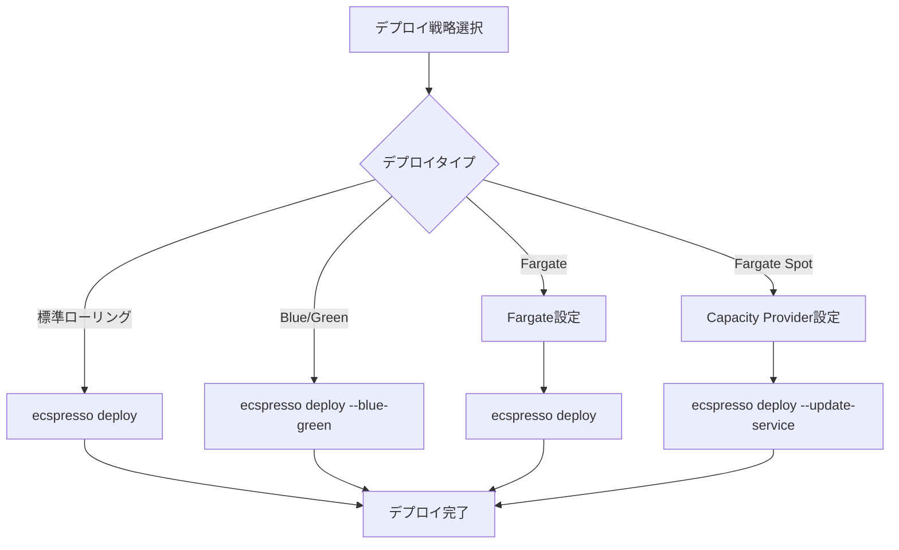

# よくあるユースケース

ecspressoの一般的なユースケースを紹介します。

## ローリングデプロイ

ECSの標準的なローリングデプロイを実行する場合：

```console
$ ecspresso deploy
```

## Blue/Greenデプロイ

AWS CodeDeployを使用したBlue/Greenデプロイを実行する場合：

```console
$ ecspresso deploy --blue-green
```

## Fargateへのデプロイ

Fargateを使用する場合、タスク定義と設定ファイルに特定の設定が必要です：

タスク定義：
- `requiresCompatibilities`に`"FARGATE"`を指定
- `networkMode`は`"awsvpc"`が必要
- `cpu`と`memory`の指定が必要

```json
{
  "taskDefinition": {
    "networkMode": "awsvpc",
    "requiresCompatibilities": [
      "FARGATE"
    ],
    "cpu": "1024",
    "memory": "2048",
    // ...
  }
}
```

サービス定義：
- `launchType`に`"FARGATE"`を指定
- `networkConfiguration`の設定が必要

```json
{
  "launchType": "FARGATE",
  "networkConfiguration": {
    "awsvpcConfiguration": {
      "subnets": [
        "subnet-aaaaaaaa",
        "subnet-bbbbbbbb"
      ],
      "securityGroups": [
        "sg-11111111"
      ],
      "assignPublicIp": "ENABLED"
    }
  },
  // ...
}
```

## Fargate Spotの利用

コスト最適化のためにFargate Spotを利用する場合：

```json
{
  "capacityProviderStrategy": [
    {
      "base": 1,
      "capacityProvider": "FARGATE",
      "weight": 1
    },
    {
      "base": 0,
      "capacityProvider": "FARGATE_SPOT",
      "weight": 1
    }
  ],
  // ...
}
```

## デプロイフロー図

以下は異なるデプロイ戦略のフロー図です：


