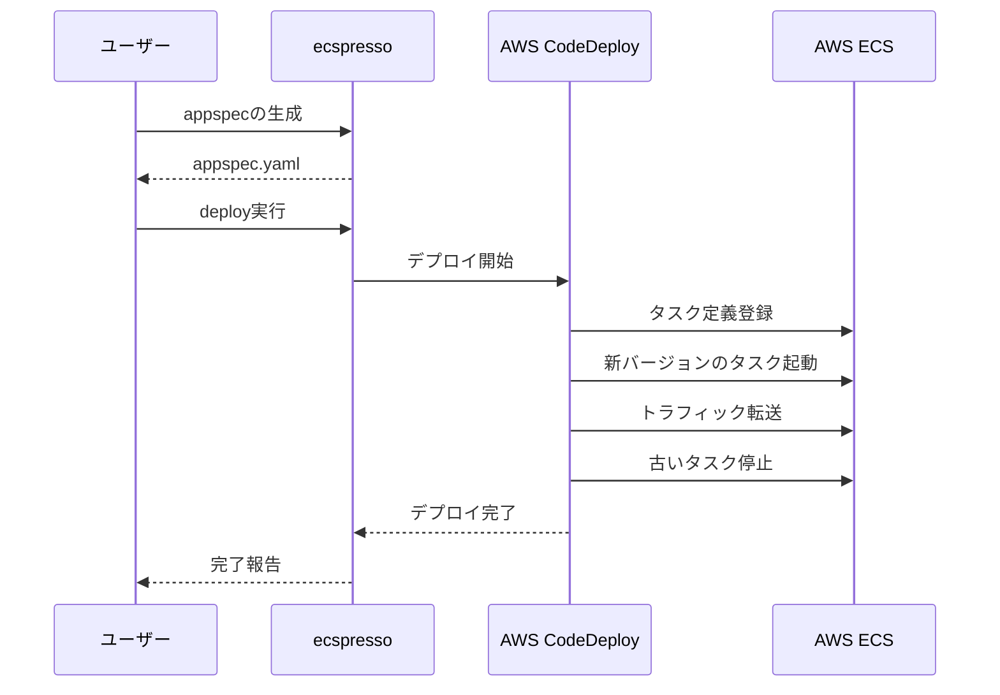
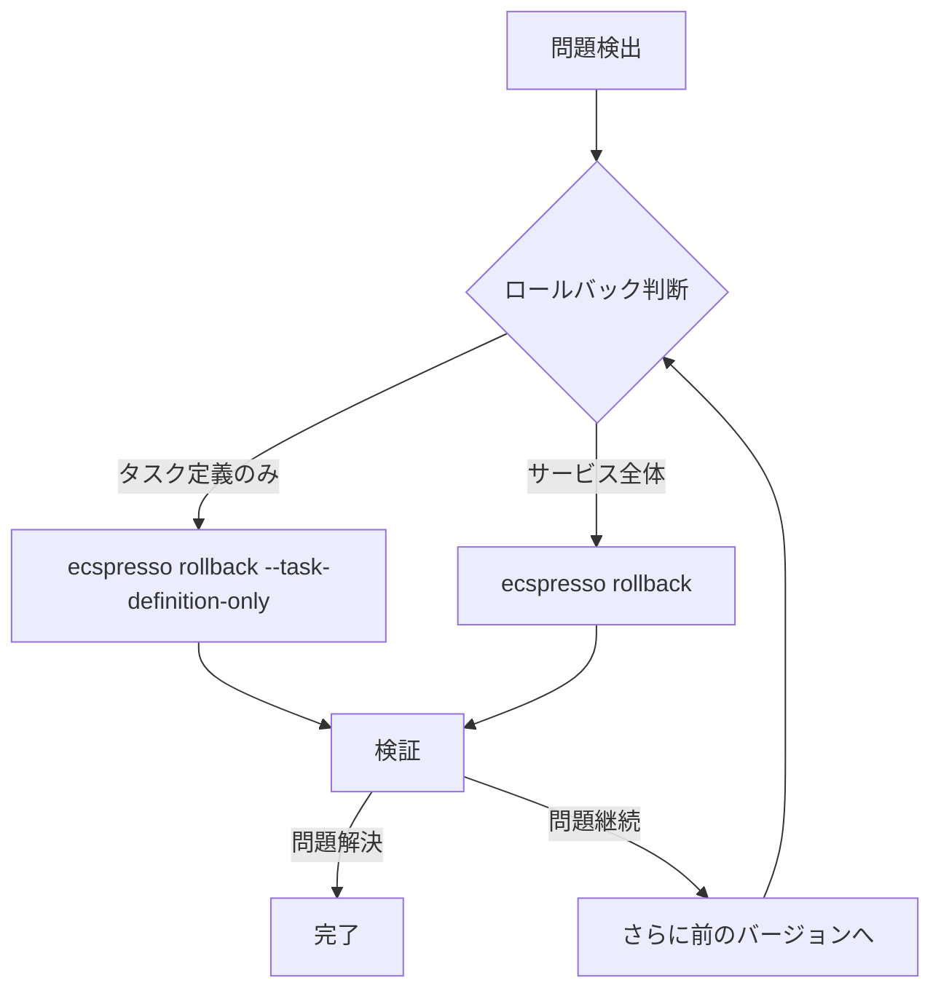

# よくあるユースケース

ここでは、ecspressoでよく行われる操作パターンを紹介します。

## Blue/Greenデプロイ

CodeDeployを使用したBlue/Greenデプロイを行います。

```console
# AppSpecの生成
$ ecspresso appspec > appspec.yaml

# デプロイの実行
$ ecspresso deploy
```



## 環境変数を使った複数環境へのデプロイ

環境変数を使用して異なる環境に対応した設定を行います。

```console
# 開発環境へのデプロイ
$ ENV=dev ecspresso deploy --envfile .env.dev

# 本番環境へのデプロイ
$ ENV=prod ecspresso deploy --envfile .env.prod
```

## サービスのスケーリング

`scale`コマンドを使用してサービスのタスク数を調整します。

```console
# タスク数を5に設定
$ ecspresso scale --tasks=5

# Auto Scalingの設定
$ ecspresso deploy --suspend-auto-scaling=false --auto-scaling-min=2 --auto-scaling-max=10
```

## タスク実行時のオーバーライド

`run`コマンドでタスク実行時にコンテナ設定をオーバーライドします。

```console
$ ecspresso run --overrides='{"containerOverrides":[{"name":"app","command":["migrate"]}]}'
```

## サービス検証

`verify`コマンドを使用して、サービス設定の検証を行います。

```console
$ ecspresso verify
```

## リソース間の差分確認

`diff`コマンドで現在のECS設定との差分を確認します。

```console
$ ecspresso diff
```

## ロールバック戦略


