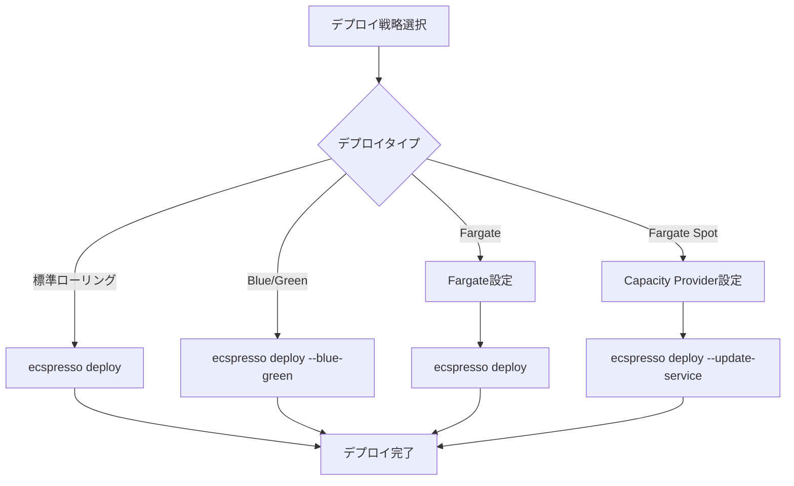

# よくあるユースケース

## ローリングデプロイ

ローリングデプロイは、ecspressoのデフォルトのデプロイ方法です：

```console
$ ecspresso deploy --config ecspresso.yml
2017/11/09 23:20:13 myService/default Starting deploy
Service: myService
Cluster: default
TaskDefinition: myService:3
Deployments:
    PRIMARY myService:3 desired:1 pending:0 running:1
Events:
2017/11/09 23:20:13 myService/default Creating a new task definition by myTask.json
2017/11/09 23:20:13 myService/default Registering a new task definition...
2017/11/09 23:20:13 myService/default Task definition is registered myService:4
2017/11/09 23:20:13 myService/default Updating service...
2017/11/09 23:20:13 myService/default Waiting for service stable...(it will take a few minutes)
2017/11/09 23:23:23 myService/default  PRIMARY myService:4 desired:1 pending:0 running:1
2017/11/09 23:23:29 myService/default Service is stable now. Completed!
```

## Blue/Greenデプロイ（AWS CodeDeployを使用）

`ecspresso deploy`は、CODE_DEPLOYデプロイメントコントローラーを使用してサービスをデプロイできます。ecs-service-def.jsonを以下のように設定します：

```json
{
  "deploymentController": {
    "type": "CODE_DEPLOY"
  },
  // ...
}
```

重要な注意点：

- ecspressoはCodeDeployリソースを作成または変更しません。ECSサービス用のアプリケーションとデプロイメントグループをCodeDeployで別途作成する必要があります。
- ecspressoはECSサービスのCodeDeployデプロイ設定を自動的に検出します。

設定ファイルでCodeDeployの設定を指定することもできます：

```yaml
# ecspresso.yml
codedeploy:
  application_name: myapp
  deployment_group_name: mydeployment
  deployment_config_name: myDeploymentConfig # オプション
```

## スケールアウト/イン

サービスの希望するタスク数を変更するには、`scale --tasks`を指定します：

```console
$ ecspresso scale --tasks 10
```

`scale`コマンドは、`deploy --skip-task-definition --no-update-service`と同等です。

## Application Auto Scalingの管理

ECSサービスでApplication Auto Scalingを使用している場合、最小値と最大値の自動スケーリング設定を`ecspresso scale`コマンドで調整できます：

```console
$ ecspresso scale --tasks 5 --auto-scaling-min 5 --auto-scaling-max 20
```

自動スケーリングの一時停止/再開：

- `--suspend-auto-scaling` - 一時停止状態をtrueに設定
- `--resume-auto-scaling` - 一時停止状態をfalseに設定

## タスクの実行

```console
$ ecspresso run --config ecspresso.yml --task-def=db-migrate.json
```

`--task-def`が設定されていない場合、ecspressoはサービスに含まれるタスク定義を使用します。

ecspressoの一般的なユースケースを紹介します。

## ローリングデプロイ

ECSの標準的なローリングデプロイを実行する場合：

```console
$ ecspresso deploy
```

## Blue/Greenデプロイ

AWS CodeDeployを使用したBlue/Greenデプロイを実行する場合：

```console
$ ecspresso deploy --blue-green
```

## Fargateへのデプロイ

Fargateを使用する場合、タスク定義と設定ファイルに特定の設定が必要です：

タスク定義：
- `requiresCompatibilities`に`"FARGATE"`を指定
- `networkMode`は`"awsvpc"`が必要
- `cpu`と`memory`の指定が必要

```json
{
  "taskDefinition": {
    "networkMode": "awsvpc",
    "requiresCompatibilities": [
      "FARGATE"
    ],
    "cpu": "1024",
    "memory": "2048",
    // ...
  }
}
```

サービス定義：
- `launchType`に`"FARGATE"`を指定
- `networkConfiguration`の設定が必要

```json
{
  "launchType": "FARGATE",
  "networkConfiguration": {
    "awsvpcConfiguration": {
      "subnets": [
        "subnet-aaaaaaaa",
        "subnet-bbbbbbbb"
      ],
      "securityGroups": [
        "sg-11111111"
      ],
      "assignPublicIp": "ENABLED"
    }
  },
  // ...
}
```

## Fargate Spotの利用

コスト最適化のためにFargate Spotを利用する場合：

```json
{
  "capacityProviderStrategy": [
    {
      "base": 1,
      "capacityProvider": "FARGATE",
      "weight": 1
    },
    {
      "base": 0,
      "capacityProvider": "FARGATE_SPOT",
      "weight": 1
    }
  ],
  // ...
}
```

## デプロイフロー図

以下は異なるデプロイ戦略のフロー図です：


