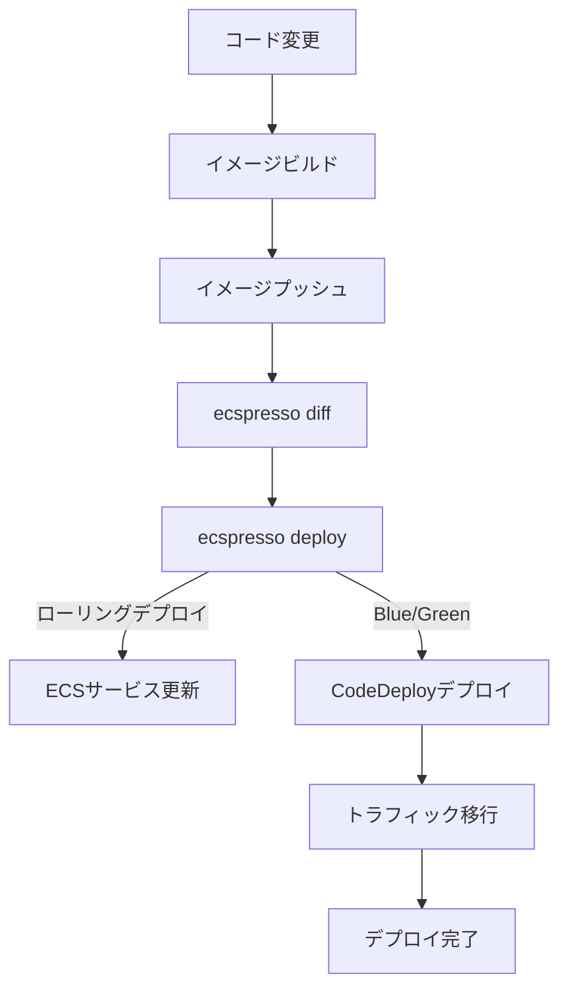

# よくあるユースケース

## ローリングデプロイ

```console
$ ecspresso deploy --config ecspresso.yml
2017/11/09 23:20:13 myService/default Starting deploy
Service: myService
Cluster: default
TaskDefinition: myService:3
Deployments:
    PRIMARY myService:3 desired:1 pending:0 running:1
Events:
2017/11/09 23:20:13 myService/default Creating a new task definition by myTask.json
2017/11/09 23:20:13 myService/default Registering a new task definition...
2017/11/09 23:20:13 myService/default Task definition is registered myService:4
2017/11/09 23:20:13 myService/default Updating service...
2017/11/09 23:20:13 myService/default Waiting for service stable...(it will take a few minutes)
2017/11/09 23:23:23 myService/default  PRIMARY myService:4 desired:1 pending:0 running:1
2017/11/09 23:23:29 myService/default Service is stable now. Completed!
```

## Blue/Greenデプロイ（AWS CodeDeployとの連携）

`ecspresso deploy`コマンドは、CODE_DEPLOYデプロイメントコントローラーを使用したサービスのデプロイが可能です。ecs-service-def.jsonを以下のように設定します。

```json
{
  "deploymentController": {
    "type": "CODE_DEPLOY"
  },
  // ...
}
```

```console
$ ecspresso deploy --config ecspresso.yml --rollback-events DEPLOYMENT_FAILURE
2019/10/15 22:47:07 myService/default Starting deploy
Service: myService
Cluster: default
TaskDefinition: myService:5
TaskSets:
   PRIMARY myService:5 desired:1 pending:0 running:1
Events:
2019/10/15 22:47:08 myService/default Creating a new task definition by ecs-task-def.json
2019/10/15 22:47:08 myService/default Registering a new task definition...
2019/10/15 22:47:08 myService/default Task definition is registered myService:6
2019/10/15 22:47:08 myService/default desired count: 1
2019/10/15 22:47:09 myService/default Deployment d-XXXXXXXXX is created on CodeDeploy
2019/10/15 22:47:09 myService/default https://ap-northeast-1.console.aws.amazon.com/codesuite/codedeploy/deployments/d-XXXXXXXXX?region=ap-northeast-1
```

## スケールアウト/イン

サービスのデザイアドカウントを変更するには、`scale --tasks`を指定します。

```console
$ ecspresso scale --tasks 10
```

## 一時的なタスクの実行

`run`コマンドを使用して、一時的なタスクを実行できます。

```console
$ ecspresso run --task-def=myapp.json --comment="run task by ecspresso"
```

## タスク上でのコマンド実行

`exec`コマンドを使用して、実行中のタスク上でコマンドを実行できます。

```console
$ ecspresso exec --command /bin/bash
```

## デプロイフロー


