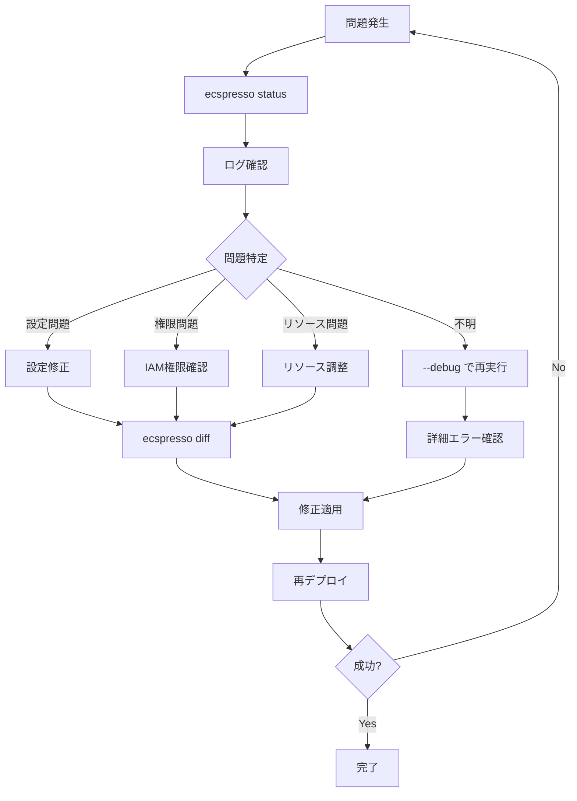

# トラブルシューティング

ecspressoを使用する際に発生する可能性のある問題と解決策を説明します。

## よくある問題と解決策

### デプロイに失敗する

**症状**: `ecspresso deploy` コマンドが失敗する

**考えられる原因と解決策**:

1. **タスク定義の問題**
   - コンテナ定義が正しくない
   - リソース制限（CPU/メモリ）が不適切
   - 解決策: `ecspresso verify` を実行して問題を特定

2. **サービス定義の問題**
   - ネットワーク設定が正しくない
   - ロードバランサーの設定が正しくない
   - 解決策: `ecspresso diff` で差分を確認し、問題を修正

3. **AWS権限の問題**
   - IAMロールに必要な権限がない
   - 解決策: IAMポリシーを確認し、必要な権限を追加

4. **リソース制限**
   - クラスターのキャパシティが不足している
   - 解決策: クラスターのキャパシティを増やすか、タスク数を減らす

### タスクが起動しない

**症状**: タスクが起動するが、すぐに停止する

**考えられる原因と解決策**:
 

1. **コンテナの問題**
   - コンテナのエントリポイントやコマンドが正しくない
   - 解決策: コンテナのログを確認し、エントリポイントやコマンドを修正

2. **メモリ不足**
   - コンテナに割り当てられたメモリが不足している
   - 解決策: タスク定義のメモリ設定を増やす

3. **ヘルスチェック失敗**
   - コンテナのヘルスチェックが失敗している
   - 解決策: ヘルスチェックの設定を確認し、アプリケーションが正しく応答することを確認

4. **ネットワーク問題**
   - セキュリティグループの設定が正しくない
   - 解決策: セキュリティグループの設定を確認し、必要なポートを開放

### ロールバックに失敗する

**症状**: `ecspresso rollback` コマンドが失敗する

**考えられる原因と解決策**:

1. **以前のタスク定義が存在しない**
   - 解決策: `ecspresso revisions` で利用可能なリビジョンを確認し、特定のリビジョンを指定

2. **サービスの状態が不安定**
   - 解決策: `ecspresso status` でサービスの状態を確認し、必要に応じて手動で修正

### 環境変数の問題

**症状**: 環境変数が正しく設定されない

**考えられる原因と解決策**:

1. **環境ファイルの形式が正しくない**
   - 解決策: 環境ファイルの形式を確認し、正しい形式に修正

2. **環境変数の優先順位の問題**
   - 解決策: 環境変数の優先順位を理解し、適切に設定

## デバッグ方法

### デバッグログの有効化

詳細なログを表示するには、`--debug` フラグを使用します。

```console
$ ecspresso deploy --debug
```

### ドライランの実行

実際の変更を行わずに操作をシミュレートするには、`--dry-run` フラグを使用します。

```console
$ ecspresso deploy --dry-run
```

### 差分の確認

変更内容を確認するには、`diff` コマンドを使用します。

```console
$ ecspresso diff
```

### リソースの検証

設定が正しいか検証するには、`verify` コマンドを使用します。

```console
$ ecspresso verify
```

## エラーメッセージと対応

### "failed to register task definition"

**原因**: タスク定義の登録に失敗しました。

**対応**:
1. タスク定義の内容を確認
2. IAM権限を確認
3. `--debug` フラグを使用して詳細なエラーメッセージを確認

### "failed to update service"

**原因**: サービスの更新に失敗しました。

**対応**:
1. サービス定義の内容を確認
2. クラスターのキャパシティを確認
3. `ecspresso status` でサービスの現在の状態を確認

### "timeout waiting for service stable"

**原因**: サービスが安定するのを待機している間にタイムアウトしました。

**対応**:
1. タスクのログを確認
2. ヘルスチェックの設定を確認
3. タイムアウト値を増やす（`--timeout` オプションまたは設定ファイルで設定）

## トラブルシューティングフロー

問題が発生した場合の一般的なトラブルシューティングフローです。



## AWS ECSの一般的な問題

ecspressoに直接関連しない、AWS ECSの一般的な問題と解決策も参考にしてください。

1. **サービスディスカバリの問題**
   - Route 53の設定を確認
   - サービスディスカバリの名前空間を確認

2. **ロードバランサーの問題**
   - ターゲットグループのヘルスチェック設定を確認
   - セキュリティグループの設定を確認

3. **Auto Scalingの問題**
   - スケーリングポリシーの設定を確認
   - CloudWatchアラームの設定を確認

4. **Fargateの問題**
   - サポートされているCPU/メモリの組み合わせを確認
   - プラットフォームバージョンの互換性を確認
