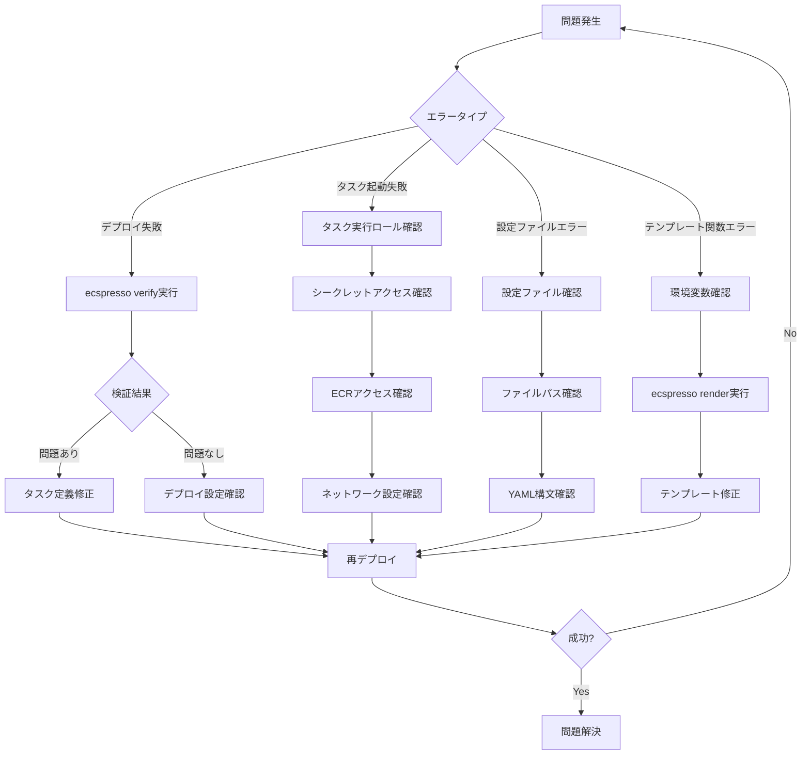

# トラブルシューティング

ecspressoを使用する際に発生する可能性のある一般的な問題とその解決方法を説明します。

## デプロイ失敗

### 症状

`ecspresso deploy`コマンドが失敗し、以下のようなエラーが表示される場合があります：

```
2023/01/01 12:00:00 service: my-service/my-cluster deploy failed: timeout
```

### 解決策

1. **タスク定義の検証**: `ecspresso verify`コマンドを実行して、タスク定義に問題がないか確認します。

2. **デプロイタイムアウトの延長**: デプロイに時間がかかる場合は、タイムアウト設定を延長します。

   ```yaml
   # ecspresso.yml
   region: ap-northeast-1
   cluster: my-cluster
   service: my-service
   service_definition: ecs-service-def.json
   task_definition: ecs-task-def.json
   timeout: 20m  # タイムアウトを20分に延長
   ```

3. **デプロイ設定の調整**: サービス定義のデプロイ設定を調整します。

   ```json
   "deploymentConfiguration": {
     "deploymentCircuitBreaker": {
       "enable": true,
       "rollback": true
     },
     "maximumPercent": 200,
     "minimumHealthyPercent": 100
   }
   ```

4. **ヘルスチェックの確認**: ALBのヘルスチェック設定とコンテナのヘルスチェック設定を確認します。

## タスク起動失敗

### 症状

タスクが起動せず、以下のようなエラーが表示される場合があります：

```
STOPPED (ResourceInitializationError: unable to pull secrets or registry auth)
```

### 解決策

1. **IAMロールの確認**: タスク実行ロールに必要な権限があるか確認します。

   ```console
   $ ecspresso verify
   ```

2. **シークレットの確認**: タスク定義で参照しているシークレットが存在し、アクセス可能か確認します。

3. **ECRリポジトリの確認**: ECRリポジトリにアクセスできるか確認します。

   ```console
   $ aws ecr get-login-password | docker login --username AWS --password-stdin <your-account-id>.dkr.ecr.<region>.amazonaws.com
   ```

4. **ネットワーク設定の確認**: VPCのサブネットとセキュリティグループの設定を確認します。

## 設定ファイルの問題

### 症状

設定ファイルの読み込みに失敗し、以下のようなエラーが表示される場合があります：

```
2023/01/01 12:00:00 load config failed: open ecspresso.yml: no such file or directory
```

### 解決策

1. **ファイルパスの確認**: 正しいディレクトリで実行しているか確認します。

2. **設定ファイルの指定**: `--config`オプションで設定ファイルを明示的に指定します。

   ```console
   $ ecspresso deploy --config /path/to/ecspresso.yml
   ```

3. **設定ファイルの構文確認**: YAMLの構文が正しいか確認します。

## テンプレート関数のエラー

### 症状

テンプレート関数の評価に失敗し、以下のようなエラーが表示される場合があります：

```
2023/01/01 12:00:00 template render failed: template: task:1:10: executing "task" at <must_env "MISSING_ENV">: error calling must_env: environment variable MISSING_ENV is not set
```

### 解決策

1. **環境変数の設定**: 必要な環境変数が設定されているか確認します。

   ```console
   $ export MISSING_ENV=value
   ```

2. **テンプレートのレンダリング確認**: `ecspresso render`コマンドを使用して、テンプレートが正しくレンダリングされるか確認します。

   ```console
   $ ecspresso render
   ```

3. **条件付き環境変数**: 必須でない環境変数の場合は、`must_env`の代わりに`env`関数を使用します。

   ```json
   {
     "value": "{{ env `OPTIONAL_ENV` `default_value` }}"
   }
   ```

## トラブルシューティングフロー図

以下はecspressoの一般的なトラブルシューティングフローを示しています：



## よくある質問

### Q: ecspressoのバージョンアップ後にデプロイが失敗します

A: 新しいバージョンでは、設定ファイルやコマンドオプションが変更されている可能性があります。リリースノートを確認し、必要に応じて設定を更新してください。

### Q: Blue/Greenデプロイが途中で止まります

A: CodeDeployのコンソールでデプロイステータスを確認してください。手動承認が必要な場合や、テストが失敗している可能性があります。

### Q: タスク定義の差分が大きすぎて確認しづらいです

A: `ecspresso diff --external "difft --color=always"`のように外部diffツールを使用すると、差分が見やすくなります。

### Q: 環境変数が正しく展開されません

A: `ecspresso render`コマンドを使用して、テンプレートがどのようにレンダリングされるか確認してください。環境変数が設定されていない場合は、適切なデフォルト値を指定するか、必要な環境変数を設定してください。
